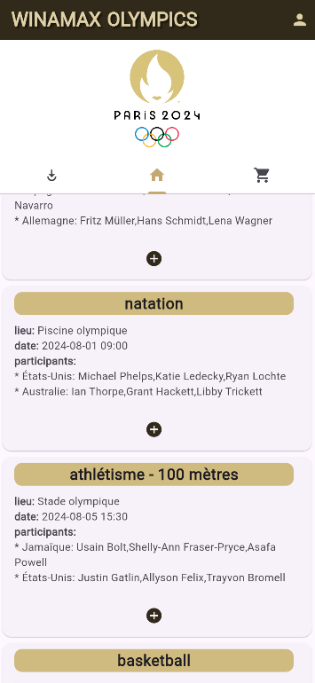

# WinaJoMax

Flutter application made to instanciate gambles for the 2024 Paris Olympics.

## Getting Started

This project is a starting point for a Flutter application.

A few resources to get you started if this is your first Flutter project:

- to start this project go to root and run to the terminal: flutter run

For help getting started with Flutter, view this documentation:
[online documentation](https://flutter.dev/docs), which offers tutorials,
samples, guidance on mobile development, and a full API reference.
